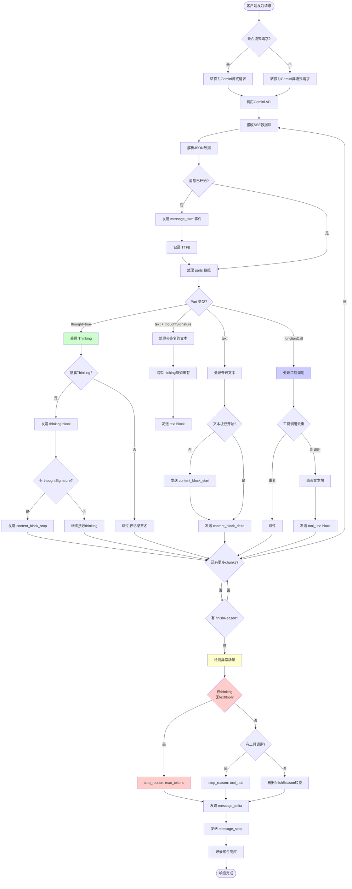
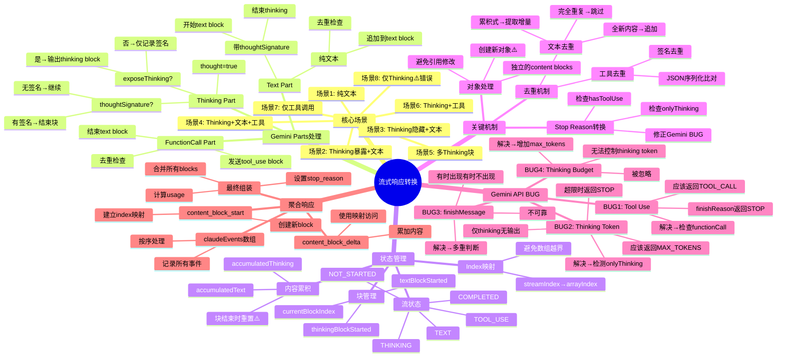

# 流式响应转换器 - 完整文档

## 目录

1. [核心流式场景](#核心流式场景)
2. [Gemini API 已知 BUG](#gemini-api-已知-bug)
3. [请求到响应流程图](#请求到响应流程图)
4. [转换逻辑思维导图](#转换逻辑思维导图)
5. [关键实现细节](#关键实现细节)
6. [问题排查指南](#问题排查指南)

---

## 核心流式场景

基于官方文档和实际测试,流式响应处理需要支持以下8种场景:

### 场景1: 纯文本响应
```json
// Gemini Response
{
  "parts": [
    {"text": "Hello, how can I help you?"}
  ],
  "finishReason": "STOP"
}

// Claude Response
{
  "content": [
    {"type": "text", "text": "Hello, how can I help you?"}
  ],
  "stop_reason": "end_turn"
}
```

### 场景2: Thinking(暴露) + 文本
```json
// Gemini Response
{
  "parts": [
    {"text": "Let me think about this...", "thought": true, "thoughtSignature": "..."},
    {"text": "Here's my answer..."}
  ],
  "finishReason": "STOP"
}

// Claude Response (exposeThinkingToClient=true)
{
  "content": [
    {"type": "thinking", "thinking": "Let me think about this..."},
    {"type": "text", "text": "Here's my answer..."}
  ],
  "stop_reason": "end_turn"
}
```

### 场景3: Thinking(隐藏) + 文本
```json
// Gemini Response - 同场景2

// Claude Response (exposeThinkingToClient=false)
{
  "content": [
    {"type": "text", "text": "Here's my answer..."}
  ],
  "stop_reason": "end_turn"
}
```

### 场景4: Thinking + 文本 + 工具
```json
// Gemini Response
{
  "parts": [
    {"text": "I need to search...", "thought": true, "thoughtSignature": "..."},
    {"text": "Let me search for you."},
    {"functionCall": {"name": "search", "args": {...}}}
  ],
  "finishReason": "STOP"
}

// Claude Response
{
  "content": [
    {"type": "thinking", "thinking": "I need to search..."},
    {"type": "text", "text": "Let me search for you."},
    {"type": "tool_use", "id": "...", "name": "search", "input": {...}}
  ],
  "stop_reason": "tool_use"
}
```

### 场景5: 多个Thinking块 + 文本 + 工具
```json
// 流式响应中thinking可能分多个parts返回
// 每个thinking块之间通过thoughtSignature分隔
```

### 场景6: Thinking + 工具调用(无文本)
```json
// Gemini Response
{
  "parts": [
    {"text": "I need to call a tool...", "thought": true, "thoughtSignature": "..."},
    {"functionCall": {"name": "read_file", "args": {...}}}
  ],
  "finishReason": "STOP"
}

// Claude Response
{
  "content": [
    {"type": "thinking", "thinking": "I need to call a tool..."},
    {"type": "tool_use", "id": "...", "name": "read_file", "input": {...}}
  ],
  "stop_reason": "tool_use"
}
```

### 场景7: 仅工具调用
```json
// Gemini Response
{
  "parts": [
    {"functionCall": {"name": "get_weather", "args": {...}}}
  ],
  "finishReason": "STOP",
  "finishMessage": "Model generated function call(s)."
}

// Claude Response
{
  "content": [
    {"type": "tool_use", "id": "...", "name": "get_weather", "input": {...}}
  ],
  "stop_reason": "tool_use"
}
```

### 场景8: 仅Thinking（错误场景）⚠️
```json
// Gemini Response (异常情况)
{
  "parts": [
    {"text": "Analyzing the problem...", "thought": true}
    // 注意: 没有 thoughtSignature, 没有 text 或 functionCall
  ],
  "finishReason": "STOP",  // ← 应该是 MAX_TOKENS
  "thoughtsTokenCount": 337
}

// Claude Response (修复后)
{
  "content": [
    {"type": "thinking", "thinking": "Analyzing the problem..."}
  ],
  "stop_reason": "max_tokens"  // ← 检测到异常,修正为 max_tokens
}
```

**重要**: 这是错误场景,表示响应异常终止(通常是token限制)。

---

## Gemini API 已知 BUG

### BUG 1: Tool Use 时 finishReason 错误

**问题描述**:
- 当响应包含 `functionCall` 时
- `finishReason` 返回 `"STOP"` 而不是 `"TOOL_CALL"` 或专门的标识
- 导致无法通过 `finishReason` 判断是否有工具调用

**影响**:
- 如果直接用 `finishReason: "STOP"` → `stop_reason: "end_turn"`,会导致对话被错误终止
- Claude Code CLI 不会发送 tool_result,任务中断

**解决方案**:
```typescript
// 检查响应中是否实际包含了functionCall
if (hasToolUse) {
  return { stop_reason: 'tool_use' };
}
```

**参考**: [GitHub Issue #12240](https://github.com/BerriAI/litellm/issues/12240)

---

### BUG 2: Thinking 超出 Token 限制时 finishReason 错误

**问题描述**:
- Extended Thinking 模式下,当 `thoughts_token_count + output_token_count > max_output_tokens`
- `finishReason` 返回 `"STOP"` 而不是 `"MAX_TOKENS"`
- 响应中**只有thinking,没有text或functionCall** (场景8)
- `thoughtSignature` 缺失,表示thinking被强制中断

**影响**:
- 如果标记为 `stop_reason: "end_turn"`,用户会认为任务正常完成
- 实际上任务因token限制而中断,没有输出实际内容

**解决方案**:
```typescript
// 检测异常情况: 仅thinking,无text或tool_use
const hasContent = stateManager.isTextBlockStarted() || stateManager.hasToolUse();
const onlyThinking = stateManager.isThinkingBlockStarted() && !hasContent;

if (onlyThinking && finishReason?.toUpperCase() === 'STOP') {
  return { stop_reason: 'max_tokens' };
}
```

**参考**: [GitHub Issue #782](https://github.com/googleapis/python-genai/issues/782)

---

### BUG 3: finishMessage 不可靠

**问题描述**:
- `finishMessage: "Model generated function call(s)."` 有时会出现,有时不会
- 不能作为唯一的判断依据

**解决方案**:
- 优先检查 `finishMessage`
- 作为备用方案,检查响应中是否实际包含 `functionCall`

---

### BUG 4: Thinking Budget 被忽略

**问题描述**:
- 即使设置了 `thinking_budget`,也会得到大量的 thinking tokens
- 导致实际输出的token被挤占

**影响**:
- 响应可能只有thinking,没有实际输出
- 需要增加 `max_output_tokens` 以留出足够空间

**参考**: [GitHub Issue #782](https://github.com/googleapis/python-genai/issues/782)

---

## 请求到响应流程图



---

## 转换逻辑思维导图



---

## 关键实现细节

### 1. Index 映射机制

**问题**: Gemini流式响应的index是累积的,但聚合时需要按content block顺序组织

```typescript
// 流式: thinking(0) → text(1) → tool_use(2) → text(3)
// 数组: [thinking, text, tool_use, text]

// 错误做法:
contentBlocks[event.data.index] = block;  // index=3时数组越界!

// 正确做法: 建立映射
if (event.type === 'content_block_start') {
  const streamIndex = event.data.index;
  const arrayIndex = contentBlocks.length;
  this.indexMap.set(streamIndex, arrayIndex);
}
```

### 2. 文本去重机制

**问题**: Gemini可能累积发送相同内容,需要提取增量

```typescript
processTextDelta(newText: string): string | null {
  // 完全重复
  if (this.accumulatedText === newText) {
    return null;
  }

  // 累积式内容 (Gemini常见模式)
  if (newText.startsWith(this.accumulatedText)) {
    const delta = newText.substring(this.accumulatedText.length);
    if (!delta) return null;
    this.accumulatedText = newText;
    return delta;
  }

  // 全新内容 - 直接追加
  const delta = newText;
  this.accumulatedText += newText;
  return delta;
}
```

**重要**: 在 `stopTextBlock()` 时必须重置 `accumulatedText`,否则会导致后续文本块被误判为重复!

### 3. Tool Use 去重

**问题**: 流式响应可能重复发送相同的tool_use

```typescript
isFunctionCallProcessed(functionCall: any): boolean {
  const signature = JSON.stringify({
    name: functionCall.name,
    args: functionCall.args
  });
  return this.processedFunctionCalls.has(signature);
}
```

### 4. 对象拷贝而非引用

**问题**: 聚合响应时,不能直接修改原始event对象

```typescript
// 错误做法:
const block = event.data.content_block;
block.text = '';
contentBlocks.push(block);  // 所有blocks都是同一个引用!

// 正确做法:
contentBlocks.push({ type: 'text', text: '' });  // 创建新对象
contentBlocks.push({ ...block });  // 拷贝对象
```

---

## 问题排查指南

### 问题1: 任务执行到一半就停止了

**可能原因**:
- Gemini返回 `finishReason: "STOP"` 但有工具调用
- `stop_reason` 被错误转换为 `"end_turn"`

**排查**:
1. 检查日志中的 `gemini-response.json`
2. 查看是否有 `functionCall`
3. 检查 `claude-response.json` 的 `stop_reason`

**预期**: 有 `functionCall` 时,`stop_reason` 应该是 `"tool_use"`

---

### 问题2: 推理后没有输出就结束了

**可能原因**:
- Thinking超出token限制 (BUG 2)
- 响应只有thinking,没有text或tool

**排查**:
1. 检查 `gemini-response.json`
2. 查看是否只有 `thought: true` 的parts
3. 检查是否有 `thoughtSignature`
4. 查看 `thoughtsTokenCount`

**预期**: `stop_reason` 应该是 `"max_tokens"`

---

### 问题3: 文本内容重复显示

**可能原因**:
- `accumulatedText` 没有在块结束时重置
- 不同的文本块被误判为同一块

**排查**:
1. 检查代码中 `stopTextBlock()` 是否重置了 `accumulatedText`
2. 查看日志中是否有多个text parts

**预期**: 每个text block独立,内容不重复

---

### 问题4: 工具调用被显示为文本

**可能原因**:
- Content block顺序错误
- Index映射问题

**排查**:
1. 检查 `claude-response.json` 的 `content` 数组顺序
2. 对比 `gemini-response.json` 的 `parts` 顺序
3. 检查 `indexMap` 是否正确

**预期**: 顺序应该一致

---

## 参考链接

- [Gemini API Function Calling](https://ai.google.dev/gemini-api/docs/function-calling)
- [Gemini API Extended Thinking](https://ai.google.dev/gemini-api/docs/thinking)
- [Claude Messages API](https://docs.anthropic.com/en/api/messages)
- [GitHub Issue #12240 - finishReason STOP with tool_call](https://github.com/BerriAI/litellm/issues/12240)
- [GitHub Issue #782 - Thinking models unreliable with max_output_tokens](https://github.com/googleapis/python-genai/issues/782)
